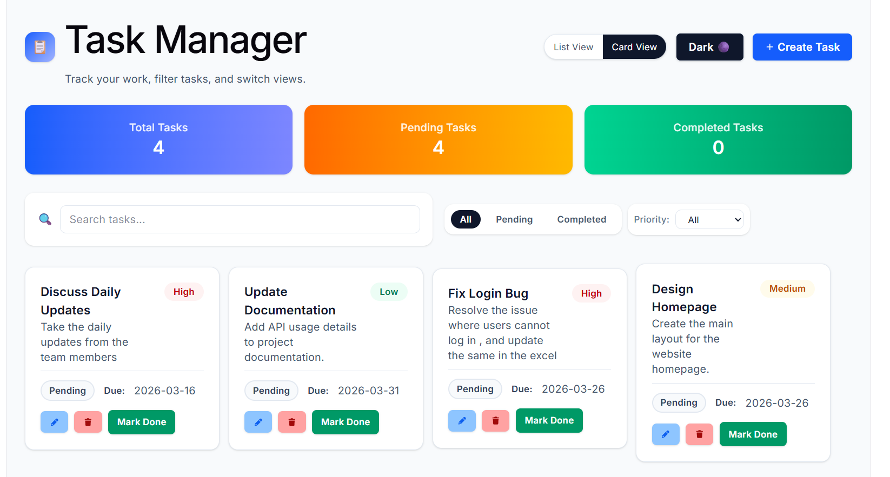
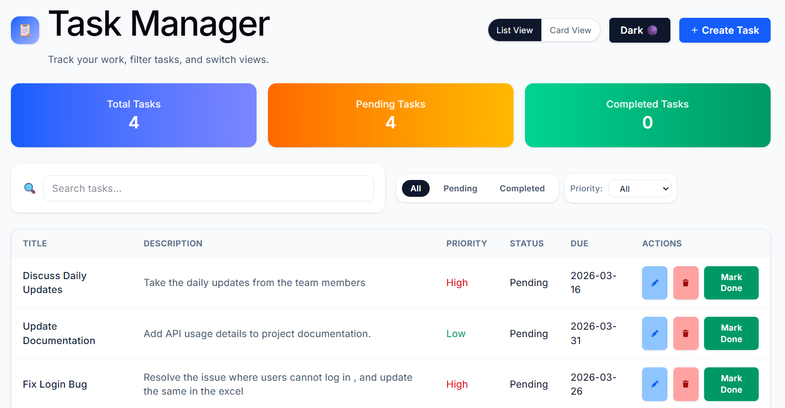
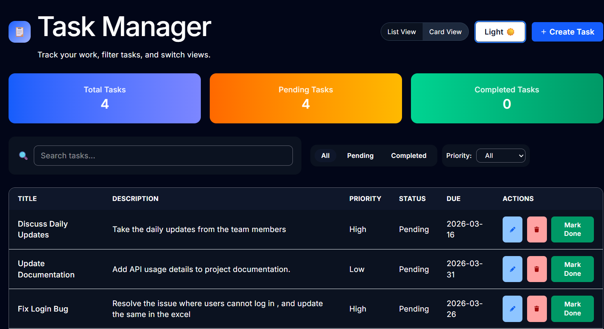

# Task Management Dashboard

A responsive **Task Management Dashboard** built with **React** that allows users to create, manage, and track tasks efficiently.
The application supports task creation, editing, deletion, filtering, and status tracking with persistent data storage.

---

## 🚀 Features

### Task Management

* Create tasks with:

  * Title
  * Description
  * Priority (Low / Medium / High)
  * Due Date
* Edit existing tasks
* Delete tasks with confirmation
* Mark tasks as **Completed** or **Pending**

### Task Views

* **List View** – Displays tasks in a structured table format
* **Card View** – Displays tasks as individual cards

### Filtering & Search

* Search tasks by **title or description**
* Filter tasks by:

  * All Tasks
  * Pending Tasks
  * Completed Tasks
  * Priority (Low / Medium / High)

### Task Statistics

Dashboard shows:

* Total Tasks
* Pending Tasks
* Completed Tasks

### Data Persistence

* Tasks are stored in **localStorage**
* Data remains available even after page refresh

### Responsive Design

* Works across:

  * Desktop
  * Tablet
  * Mobile devices


---

# 🛠️ Tech Stack

* **React**
* **Vite**
* **Tailwind CSS**
* **JavaScript**
* **localStorage**

---


```
src
│
├── components
│   ├── TaskForm.jsx
│   ├── TaskCard.jsx
│   ├── TaskList.jsx
│   ├── Filters.jsx
│   └── Stats.jsx
│
├── pages
│   └── Dashboard.jsx
│
├── tests
│   ├── TaskCard.test.jsx
│   ├── TaskList.test.jsx
│   └── TaskForm.test.jsx
│
├── App.jsx
└── main.jsx
```

---

# ⚙️ Installation & Setup

### 1️⃣ Clone the repository

```
https://github.com/Pranali209/Licious_Assigment.git
```

### 2️⃣ Navigate to the project folder

```
cd Licious_Assigmen
```

### 3️⃣ Install dependencies

```
npm install
```

### 4️⃣ Run the development server

```
npm run dev
```

The app will run at:

```
http://localhost:5173
```

---


# 📸 Screenshots

## Dashboard Overview



## List View



## Dark theme



---


`localStorage` is used to persist task data so users don't lose their tasks after refreshing the page.

---


---


